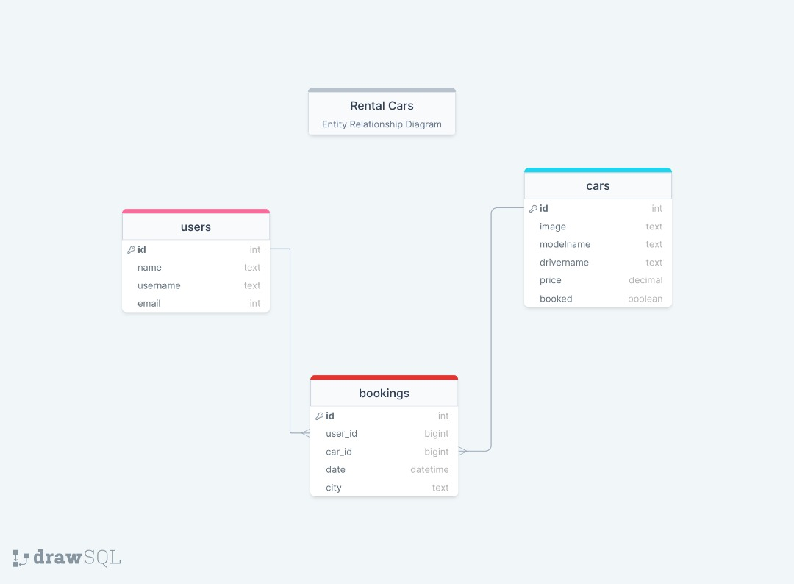

<br />
<p align="center">
Final Capstone Project
</p>

  <h1 align="center"><strong>"RENT A CAR"</strong></h1>

  <p align="center">
    This is the final capstone project for the Full Stack Developer Program at Microverse
    <br />
    <a href="https://github.com/shahira-sadat/final-capstone-project-frontend">Front-end repo</a>
    -
    <a href="https://github.com/nimplay/final-capstone-project">Back-end repo</a>
    <br />
    <a href="https://github.com/shahira-sadat/final-capstone-project-frontend/issues">Report Bug</a>
    -
    <a href="https://github.com/nimplay/final-capstone-project/issues">Request Feature</a>
  </p>
</p>

## Table of Contents:

* [About the Project](#about-the-project)
* [Project requirements](#project-requirements)
* [Entity Relation Diagram](#entity-relation-diagram)
* [Built With](#built-with)
* [Usage](#usage)
* [Testing](#testing)
* [Kanban Board](#kanban-board)
* [Authors](#authors)
* [Show your support](#show-your-support)
* [Acknowledgements](#acknowledgements)
* [License](#license)

## About The Project:


## Project requirements:

The basic project requirements are defined by Microverse and can be seen in this <a href="https://github.com/microverseinc/curriculum-final-capstone/blob/main/projects/business_requirements.md#project-requirements">link</a>.

User stories:  In addition to the basic project requirements, a set of specific requirements was developed from a list of user stories, as shown below:

A) When I go to the home page:
1. I can see a selection of the latest properties to rent on the home page, with 1 photo, property title, country, city,  and rate.
2. If I click on a photo or property title, I can see:
- The property title,
- The whole address,
- The category or categories assigned by the owner (beach, family, honeymoon, mountain, etc.),
- A big photo and several photo miniatures that can show bigger in a popup if clicked,
- A description,
- The guest_capacity, the number of bedrooms, beds, baths,
- The kind of property (house, apartment, villa, etc.),
- The size (must indicate what measurement unit is the size, mts2 or ft2, etc),
- The rate per night, week, month,
- The minimum period of time that the property rents for,
- The cleaning fee,
- A button or link to go to the reservation page for this property,
- A button or link to go back to the home page

3. I can also see a select button to select a country to show properties for that country only.
4. After selecting a country, I can see a title indicating the chosen country, and the list of properties for that country with 1 photo, property title, country, city,  and the rate per night, week, etc.  Also, inside a parenthesis, must be the minimum time for rent.
5. After clicking on one photo or property title, I can see all the same information shown in A.2. But the button or link to go back must take me to the country list page.
6. When I click the reservation button, I can see the fields to enter check_in and check-out dates (or a calendar to select dates), and also a field to enter the number of guests that will stay in the property (the entered number of guests must be greater than 0, and smaller or equal to the guest capacity of the property).
7. I can see a “Check dates” button to check if the requested reservation period is available.
8. After clicking on this button, I can see the messages: “The property is available for your requested dates” or “Sorry, the property is not available for your requested dates. Please try a different time period”.
9. If there isn’t availability, I can enter different dates to start a new check with the Check dates button.
10. I can also see a button to go back to the properties list (home page or country list page).
11. If there is availability, the page also shows the total amount to pay for the reservation.
12. The page shows a “Reserve” button if there is availability.
13. If I click the “Reserve” button, that takes the user to a page for signing up (with name, email, and password) or logging in (with email and password).
14. After successfully sing up or logging in, the page opens again the reservation page with the reservation information (user name, property title, check-in and check-out dates, total amount to pay). It shows also a confirmation message with the reservation ID and tells the user that an email will be sent to her/his email address with instructions for paying the reservation.
15. If the user was already logged in, the signup or log-in is skipped.

B) In the navbar I can see a button or link to “Become a Host”. If I click this button I will see:
- The page for signing up (with name, email, and password) or logging in (with email and password).
- After successfully sing up or logging in, I can see a form to upload all information and photos for a new property (see A.2).
- If the user was already logged in, the “Become a Host” button takes the user directly to the form, without requesting sign up or log in.
- After entering the new property info, the page shows the homepage and a message with: “Thank you for uploading your property”.
- There must be an option for the property owner to block periods of time to avoid users to make reservations on those periods.

C) In the navbar I can see also buttons or links to sign up, log in, and log out.

D) In the navbar I can see a button to show the list of all uploaded properties for the logged-in user. After clicking this button, the page shows the list of property names uploaded by the logged-in user. Each name is a link to the show page of the property. If a name is clicked, the page will show:
- The name of the property,
- A button for updating general information,
- A button for deleting the property from the list,
- And a "Block periods" button for creating blocked periods.
- If the "Block periods" button is clicked, the page shows a form with two input fields (or a calendar) to enter start and end dates for the block period, and a button to save the new blocked period. After saving the blocked period, the page shows again the list of uploaded properties for this user, which contains a button to navigate to the homepage.

E) In the navbar I can see a button to show the list of all the reservations created by the logged-in user, with the name of the property, reservation Id, and a button to delete it.


## Entity Relation Diagram:


  </a>

## Built With:
This project was built using these technologies:
* Ruby
* Ruby on Rails
* React
* Redux
* HTML
* CSS
* JavaScript
* PostgreSQL, pgAdmin 4
* JSON Web Token (JWT)
* API integration
* Render
* Nelify
* Rubocop
* Capybara
* Rspec
* OpenApi(Swagger)
* GitHub, Gitflow
* Visual Studio

## Live Demo:
To visit the live API site, please Click [here.](https://639355566c9e9858f93bb1bb--bejewelled-cucurucho-3790b4.netlify.app/)

## squema



## API Documentation:
To see the API documentation, please Click [here.](https://cars-rental.onrender.com/api-docs/index.html)

## Usage:

To have this app on your pc, you need to:

  - Clone with SSH:
  ```
git@github.com:nimplay/final-capstone-project.git
  ```
  - Clone with HTTPS
  ```
https://github.com/nimplay/final-capstone-project.git
  ```

* In the project directory, you can run:

  - `$ bundle install` - installs all the dependencies required by the project

  Run 'Rails s' command to run the Ruby on Rails server and launch your browser to see the project

## Testing:

Tu run the test in your terminal, please type: `rspec spec/capybara`


## Kanban Board:

Link to the project Kanban board: <a href="https://github.com/nimplay/final-capstone-project/projects/1">Click here</a>.

Link to the screenshot of the initial state of the Kanban board: <a href="https://user-images.githubusercontent.com/102382778/203821762-58fc95d8-95e5-4008-9016-e158edb2236d.png">Click here</a>.


## Authors:

👤 ** Nimrod Acosta **
- GitHub: [nimplay](https://github.com/nimplay)
- Twitter: [NimrodAcosta](https://twitter.com/NimrodAcosta)
- LinkedIn: [nimrod-acosta](https://www.linkedin.com/in/nimrod-acosta-734330169/)


👤 *Shahira Sadat*👩🏻‍💻
- GitHub: [Shahira Sadat](https://github.com/shahira-sadat)
- Twitter: [Shahira Sadat](https://twitter.com/SadatShahira)
- Linkedin: [Shahira Sadat](https://www.linkedin.com/in/shahira-sadat-49b402199)

👤 **Williams Colmenares**
- GitHub: [@williamscch](https://github.com/williamscch)
- Twitter: [@wdavidcch](https://twitter.com/wdavidcch)
- LinkedIn: [Williams Colmenares on LinkedIn](https://www.linkedin.com/in/williamscolmenaresch/)


## Show your support:

Give a :star: if you like this project!


## Acknowledgements:

- Based on the [design](https://www.behance.net/gallery/26425031/Vespa-Responsive-Redesign) by [Murat Korkmaz](https://www.behance.net/muratk) on Behance.
- Hat tip to anyone whose code was used
- Microverse
- Our supportive families 😊

## License:
This project is [MIT](./LICENSE) licensed.
=======
# Rental cars

This project is made for the Renting of cars. You can add, reserve and delete cars from our website!

Our website features:
 - Users can see details of all the cars
 - Users can reserve cars that are booked
 - Users can add cars
 - Users can remove cars
 - About us(dev team)

## Project Documentation 📄

- Live Demo [link](https://6391f321f275451d6914f18c--mellow-monstera-101e02.netlify.app/)
- API Deployment [link]()
- API GitHub Repo [link](https://github.com/nimplay/final-capstone-project)

## Kanban Board:

### Kanban Board [link](https://github.com/nimplay/final-capstone-project/projects/1)

### Initial state of the Kanban Board:


### Team members: 3 (Williams Colmenares, Shahira Sadat, Nimrod Acosta)

## Built With 🛠️

 - Programming Languages: HTML, CSS, JavaScript
 - Frameworks: React, Redux and Bootstrap
 - Code Editor: VS Code

## Getting Started

To get a local copy up and running follow these simple steps.

> You can check if Git is installed by running the following command in the terminal.
```
$ git --version
```
> Likewise for Node installation.
```
$ node --version
```

### Setup

Clone the repository using the GitHub link provided below.

### Install

In the terminal, go to your file directory and run this command.
```
$ git clone git@github.com:shahira-sadat/final-capstone-project-frontend.git
```
### Usage

### Run locally

Make your way to the correct directory by running this command:

```
$ cd final-capstone-project-frontend
```

Install the required dependencies to run the project with this command:
```
$ npm install
```

Then run it in your browser with this command:

```
$ npm start
```

Kindly modify the files as needed.

### Run tests

To run tests, please run this command
```
$ npm run test
```
## Authors

👤 ** Nimrod Acosta **
- GitHub: [nimplay](https://github.com/nimplay)
- Twitter: [NimrodAcosta](https://twitter.com/NimrodAcosta)
- LinkedIn: [nimrod-acosta](https://www.linkedin.com/in/nimrod-acosta-734330169/)


👤 *Shahira Sadat*👩🏻‍💻
- GitHub: [Shahira Sadat](https://github.com/shahira-sadat)
- Twitter: [Shahira Sadat](https://twitter.com/SadatShahira)
- Linkedin: [Shahira Sadat](https://www.linkedin.com/in/shahira-sadat-49b402199)

👤 **Williams Colmenares**
- GitHub: [@williamscch](https://github.com/williamscch)
- Twitter: [@wdavidcch](https://twitter.com/wdavidcch)
- LinkedIn: [Williams Colmenares on LinkedIn](https://www.linkedin.com/in/williamscolmenaresch/)


## 🤝 Contributing

Contributions, issues, and feature requests are welcome!

Feel free to check the [issues page](../../issues/).

## Show your support

Give a ⭐️ if you like this project!

## Acknowledgments
- [Microverse](https://www.microverse.org/)
- Original design idea by [Murat Korkmaz on Behance](https://www.behance.net/muratk)
- [FontAwesome](https://fontawesome.com/) for icons
- [Unsplash](https://unsplash.com/) for images
- Hat tip to anyone whose code was used
- Our supportive families 😊


## 📝 License
This project is MIT licensed.

